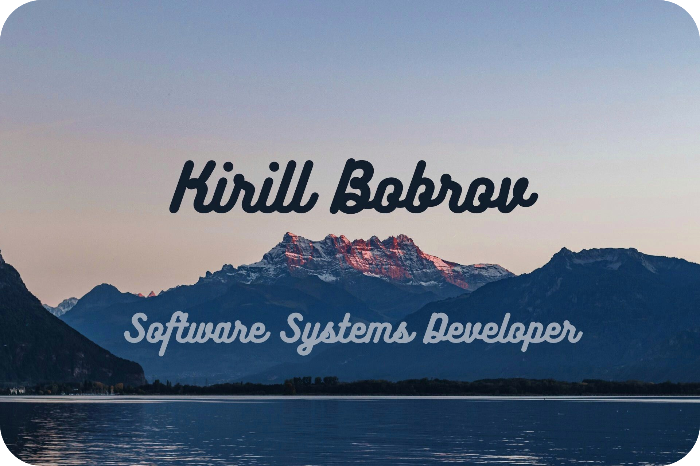

<p align="center">
  
</p>

## General
- 🎓 **Student of Software Systems Development** at the [University of Hamburg](https://www.uni-hamburg.de/en.html) (since 2024).
- 🌟 Creative, curious, and ambitious individual passionate about coding and continuous learning.
- 📚 Love reading books, playing piano, and working on personal projects.
- 💼 Skilled at organizing team work and sharing knowledge, with strong soft skills to collaborate effectively.
- 🌍 Fluent in **English**, **Russian**, and **German**.
- 🚀 Striving to be an innovative leader and an extraordinary developer.
- 📮 You can reach me by email at bobrov7tech@gmail.com.

## [WakaTime](https://wakatime.com/@h_off_nung)

<!--START_SECTION:WakaTime-->

```txt
From: 22 September 2024 - To: 31 October 2024

Total Time: 25 hrs 14 mins

Swift              12 hrs 1 min    ▓▓▓▓▓▓▓▓▓▓▓▓░░░░░░░░░░░░░   47.66 %
Python             8 hrs 46 mins   ▓▓▓▓▓▓▓▓▓░░░░░░░░░░░░░░░░   34.76 %
YAML               1 hr 43 mins    ▓▓░░░░░░░░░░░░░░░░░░░░░░░   06.85 %
Markdown           1 hr 20 mins    ▓░░░░░░░░░░░░░░░░░░░░░░░░   05.33 %
Bash               26 mins         ░░░░░░░░░░░░░░░░░░░░░░░░░   01.76 %
```

<!--END_SECTION:WakaTime-->

## Skills
- **Communication**: Excellent at finding common language with people, which helps in both team collaboration and project leadership.
- **Teamwork**: Experienced in organizing group projects, ensuring everyone contributes and learns together.
- **Problem-solving**: Enjoy tackling complex problems with a creative mindset and a drive for innovation.
- **Leadership**: Aiming to lead projects and teams with a focus on innovation and efficiency.

## Technology
### **Swift**
- 💡 **Why Swift?** Swift is Apple's powerful and intuitive programming language for macOS, iOS, and beyond. It's fast, secure, and an excellent choice for modern app development due to its clean syntax and performance optimization. Knowing Swift is essential for anyone diving into the Apple ecosystem.

### **Java**
- 🏛️ **Why Java?** Java remains a foundational language in software development. It's object-oriented, highly portable, and widely used in large-scale systems and Android app development. Its versatility makes it a great choice for enterprise applications.

### **Python**
- 🐍 **Why Python?** Python is a flexible, easy-to-learn language that excels in web development, data analysis, AI, and automation. With its rich libraries and community support, Python continues to dominate in areas like machine learning and data science.

### **JavaScript**
- 🌐 **Why JavaScript?** JavaScript is the backbone of web development, enabling dynamic, interactive web pages. Mastering it opens doors to full-stack development and front-end frameworks, making it essential for modern web developers.

### **React**
- ⚛️ **Why React?** React is a powerful JavaScript library for building user interfaces. It’s component-based, allowing for reusable code and faster development. React dominates in front-end development, making it a must-have for anyone serious about building modern web apps.